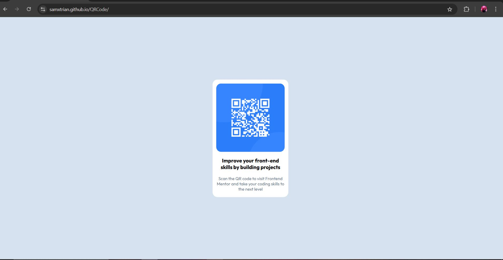

# Frontend Mentor - QR code component solution

This is a solution to the [QR code component challenge on Frontend Mentor](https://www.frontendmentor.io/challenges/qr-code-component-iux_sIO_H). Frontend Mentor challenges help you improve your coding skills by building realistic projects. 

## Table of contents

- [Overview](#overview)
  - [Screenshot](#screenshot)
  - [Links](#links)
- [My process](#my-process)
  - [What I learned](#what-i-learned)
  - [Continued development](#continued-development)
  - [Useful resources](#useful-resources)
- [Author](#author)

## Overview

### Screenshot

### Links

- Solution URL: [Github](https://github.com/Samxtrian/QRCode)
- Live Site URL: [Live site](https://samxtrian.github.io/QRCode/)

## My process

### What I learned

Reviewed basic HTML, css concepts, relative styling

### Continued development

Need to focus on more dynamic pages, getting comfortable with flexbox css, inline displays

### Useful resources

https://stackoverflow.com/- This helped me with setting up appropriate scalable padding.
https://www.w3schools.com/ - Helped me refresh my css knowledge

## Author
Samxtrian
